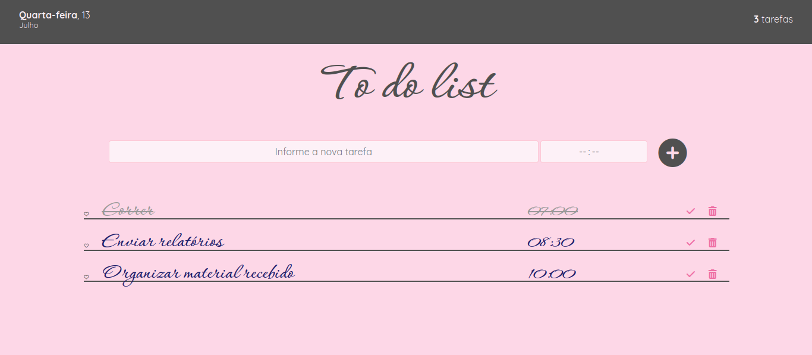
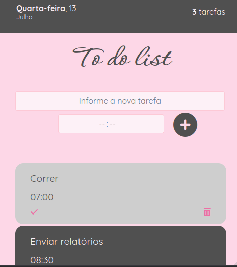

# TO DO LIST :page_with_curl:

Este projeto apresenta uma lista de tarefas (to do list). Tem-se como objetivo praticar o uso da biblioteca jQuery, utilizando-a para selecionar, remover e modificar diferentes elementos na página. Nesta aplicação responsiva também é utilizado o *framework* Bootstrap, versão 4, na estilização.

## :gear: Tecnologias

- HTML
- CSS
- JavaScript
- jQuery
- Bootstrap

## :art: Layout

